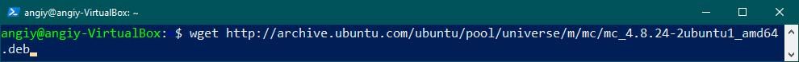

# Итоговая контрольная работа

### Информация о проекте
 Необходимо организовать систему учета для питомника в котором живут домашние и Pack animals.

### Как сдавать проект

Для сдачи проекта необходимо создать отдельный общедоступный репозиторий(Github, gitlub, или Bitbucket). Разработку вести в этом репозитории, использовать пул реквесты на изменения. Программа должна запускаться и работать, ошибок при выполнении программы быть не должно. Программа, может использоваться в различных системах, поэтому необходимо разработать класс в виде конструктора

## Задание

### 1. Используя команду cat в терминале операционной системы Linux, создать два файла Домашние животные (заполнив файл собаками, кошками, хомяками) и Вьючные животными (заполнив файл Лошадьми, верблюдами и ослы), а затем объединить их. Просмотреть содержимое созданного файла. Переименовать файл, дав ему новое имя (Друзья человека).

Создаем файл "Домашние животные" (Pets):

Создаем файл "Вьючные животные" (Pack_animals):

Объединяем содержимое двух файлов в один (United.txt)

Переименовываем полученный файл в "Друзья человека" (Human_Friends.txt)

### 2. Создать директорию, переместить файл туда.

Создаем новую директорию NewDir

Перемещаем туда файл Human_Friends.txt

### 3. Подключить дополнительный репозиторий MySQL. Установить любой пакет из этого репозитория.

Устанавливаем MySql

### 4. Установить и удалить deb-пакет с помощью dpkg.

Установка deb-пакета mc

Удаление deb-пакета

### 5. Выложить историю команд в терминале ubuntu.
Просмотр истории команд

~~~
   1  ls
   2  cat > Pets.txt
   3  ls
   4  cat > Pack_animals.txt
   5  ls
   6  cat Pets.txt Pack_animals.txt > United.txt
   7  ls
   8  cat United.txt
   9  mv United.txt Human_Friends.txt
   10  ls
   11  mkdir NewDir
   12  ls
   13  mv Human_Friends.txt NewDir/
   14  ls
   15  cd NewDir
   16  ls
   17  cd ~
   18  wget https://dev.mysql.com/get/mysql-apt-config_0.8.28-1_all.deb
   19  sudo dpkg -i mysql-apt-config_0.8.28-1_all.deb
   20  sudo apt-get update
   21  sudo apt-get install mysql-server
   22  systemctl status mysql
   23  wget http://archive.ubuntu.com/ubuntu/pool/universe/m/mc/mc_4.8.24-2ubuntu1_amd64.deb
   24  sudo dpkg -i mc_4.8.24-2ubuntu1_amd64.deb
   25  sudo apt install -f
   26  mc
   27  sudo dpkg -r mc

~~~

### 6. Нарисовать диаграмму, в которой есть класс родительский класс, домашние животные и вьючные животные, в составы которых в случае домашних животных войдут классы: собаки, кошки, хомяки, а в класс вьючные животные войдут: Лошади, верблюды и ослы.

### 7. В подключенном MySQL репозитории создать базу данных “Друзья человека”.

### 8. Создать таблицы с иерархией из диаграммы в БД.

### 9. Заполнить низкоуровневые таблицы именами(животных), командами которые они выполняют и датами рождения.

### 10. Удалив из таблицы верблюдов, т.к. верблюдов решили перевезти в другой питомник на зимовку. Объединить таблицы лошади, и ослы в одну таблицу.

### 11. Создать новую таблицу “молодые животные” в которую попадут все животные старше 1 года, но младше 3 лет и в отдельном столбце с точностью до месяца подсчитать возраст животных в новой таблице.

### 12. Объединить все таблицы в одну, при этом сохраняя поля, указывающие на прошлую принадлежность к старым таблицам.

### 13.Создать класс с Инкапсуляцией методов и наследованием по диаграмме.

### 14. Написать программу, имитирующую работу реестра домашних животных.
В программе должен быть реализован следующий функционал:

#### 14.1 Завести новое животное
#### 14.2 определять животное в правильный класс
#### 14.3 увидеть список команд, которое выполняет животное
#### 14.4 обучить животное новым командам
#### 14.5 Реализовать навигацию по меню

### 15. Создайте класс Счетчик, у которого есть метод add(), увеличивающий̆ значение внутренней̆int переменной̆на 1 при нажатие “Завести новое животное” Сделайте так, чтобы с объектом такого типа можно было работать в блоке try-with-resources. Нужно бросить исключение, если работа с объектом типа счетчик была не в ресурсном try и/или ресурс остался открыт. Значение считать в ресурсе try, если при заведения животного заполнены все поля.